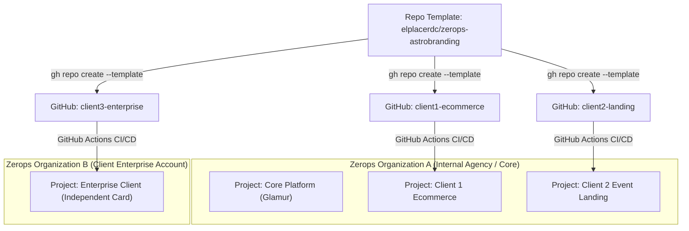

# Zerops AstroBranding Sovereign Platform (Modular Template Monorepo)

> High-Performance, Sovereign Fullstack, AI & Astrological Branding Monorepo Template for Zerops Incus LXC Runtimes.  
> Governed by CoHaLo v8.4, Dual-RAG SSoT Architecture, and Step-by-Step Natural-Language Modular Deployment.

---

## 🏛️ Two-Tier Architecture: Control Plane & LXC Runtimes

The platform separates platform orchestration from application execution across two distinct, isolated tiers:

1. **Sovereign Control Plane (`zcp`)**:
   - Dedicated orchestrator container running the Zerops MCP, GitOps tools, and Google Drive SSoT synchronization.
   - Does **not** run local dev servers or heavy framework compiles (`bun`, `node`, `pytest` are forbidden on `zcp`).
   - Executes platform workflows, manages secret injection via `zerops_env`, and verifies cluster health.
2. **Dedicated Incus LXC Runtimes**:
   - Each application service (`freellmapi`, `bifrost`, `hermes`, `evolution`, `astrobranding`, `listmonk`) runs in its own isolated Incus LXC container.
   - Framework builds (`bun run build`, `npm test`, `pytest`) and dev servers run inside the respective containers over SSH (`ssh {hostname} "cd /var/www && <cmd>"`). Long-running servers are managed via `zerops_dev_server`.

```text
├── apps/
│   ├── astrobranding/      # [Runtime 1] Agnostic Fullstack Web Engine (Astro 5 SSR + React 19 Islands + Hono + BullMQ) [:3000]
│   ├── bifrost/            # [Runtime 2] Maxim AI Enterprise Gateway (Go 1.22, chromem semantic cache, PG18) [:8080]
│   ├── freellmapi/         # [Runtime 3] Multi-Provider Free LLM Proxy with 429 Circuit Breaker (localstorage SQLite) [:3001]
│   ├── evolution/          # [Runtime 4] Native WhatsApp Engine (Go whatsmeow, NATS JetStream events, PG18, Valkey) [:8085]
│   ├── hermes/             # [Runtime 5] Autonomous Copilot (Python 3.12, NATS JetStream daemon, Bifrost proxy) [:8000]
│   └── listmonk/           # [Runtime 6] High-Performance Newsletter & Transactional Email Engine [:9000]
├── recipes/
│   ├── steps/              # Sequential Surgical Deployment Recipes (01 to 06)
│   └── services/           # Granular Service Manifests for On-Demand Provisioning
├── packages/
│   ├── contracts/          # Zod 4 Schemas, 15 Shards, Feeds, Multi-Payment & Frappe DTOs (SSoT)
│   ├── database/           # PostgreSQL 18 (pgvector HNSW + uuidv7() + 15 Shards JSONB + Outbox)
│   └── engine/             # Typed SDKs, Multi-Gateway Payment Drivers, Frappe Client & Astrological Orchestrator
├── docs/
│   ├── MODULARIZATION_ROADMAP.md # Master Roadmap & Execution Matrix for Successor AGYs
│   ├── AUDIT_BIFROST_FREELLMAPI.md # Empirical Cache & Virtual Keys Benchmark Report
│   └── MANUAL_COCKPIT.md   # Operator Guide
├── iniciar.sh              # Cold-Start ZCP Control Plane Bootstrapper (SSoT, Tools, Secrets)
├── zerops.yaml             # Multi-Service Build & Run Manifest for Runtimes
└── import.yaml             # Canonical Cluster Manifest (Full 10-Service Sovereign Mesh)
```

---

## 🎛️ Dual-Surface Operation: Operator CLI & Visual AI Builder

The template supports two complementary operational surfaces depending on the user profile:

### Surface A: Backend-First / Natural Language via AGY in ZCP Code-Server
For developers, DevOps engineers, and autonomous agents (AGY). Operation occurs directly in the ZCP container terminal or VS Code Web:
- **Zero Click Deployments**: The operator asks AGY in natural language to provision any component or combination:
  - *"Instala una tienda ecommerce con WhatsApp y pagos"* $\to$ Deploys FreeLLMAPI, Bifrost, PostgreSQL 18, Valkey, EvolutionGo, and Astro-Web with payment funnels.
  - *"Instala una landing para evento online/presencial"* $\to$ Deploys FreeLLMAPI, Bifrost, Listmonk, and Astro-Web.
  - *"Instala freellmapi y bifrost"* $\to$ Deploys `recipes/steps/01-freellmapi.yaml` and `02-bifrost-postgres.yaml`.
  - *"Instala el ecosistema completo"* $\to$ Deploys the complete 10-service canonical mesh via `import.yaml`.
- **Surgical Execution**: AGY executes recipes sequentially, wires environment credentials via `zerops_env`, and tests physical readiness probes.

### Surface B: Downstream Visual AI Project Builder (Chat + Toggles UI)
For non-technical founders, marketing operators, and end clients. A dedicated visual web application built on Astro 5 + Solid/React provides an intuitive setup wizard:
- **Natural Language Prompting**: The user inputs requirements in plain language:
  - *"Quiero un ecommerce de moda femenina con envíos contra entrega"*
  - *"Quiero una landing para vender un retiro presencial y membresía"*
  - *"Quiero la página web para mi marca personal de consultoría"*
- **Modular Toggle Matrix**:
  - **LLM Gateway (Mandatory & Automatic)**: Bifrost (:8080) + FreeLLMAPI (:3001) are automatically provisioned as the core AI backbone with automatic fallback and zero-cost inference.
  - **WhatsApp Messaging Toggle**: Enables Evolution Go (whatsmeow) for conversational sales and abandoned cart recovery.
  - **Autonomous Agents Toggle**: Enables Hermes Agent copilot with NATS JetStream event mesh.
  - **Email Marketing Toggle**: Enables Listmonk for automated transactional and newsletter delivery.
  - **Multi-Payment Gateways Toggle**: Activates Wompi, ePayco, dLocal Go, or Stripe checkouts.
  - **AstroBranding / Oráculo Engine Toggle (Optional)**: Can be activated for projects requiring astrological branding diagnosis (Carta Natal, BaZi, Human Design). If a client already has an established logo and brandbook, this layer is skipped while keeping all other web features active.

---

## 🏢 Multi-Project & Multi-Organization Architecture

Zerops architecture provides strict boundaries for managing multiple clients and workloads with complete resource, network, and financial independence:



### 1. The Single Sovereign Template Repo Model
Each new application or client receives its own independent GitHub repository cloned from this template:
```bash
# Create an independent client repository from the sovereign template
gh repo create mycompany/client-store --template elplacerdc/zerops-astrobranding --private
```
- **No Monorepo Entanglement**: Eliminates git conflicts, shared credentials, and monolithic deployment bloat.
- **Independent CI/CD**: Each repo contains `.github/workflows/deploy.yaml` pushing changes directly to the respective Zerops project.

### 2. Multi-Project within a Single Organization
- **Network Isolation**: Every Zerops Project operates on its own dedicated VXLAN overlay network. Containers in Project A cannot access containers in Project B via internal hostnames.
- **Itemized Billing**: Zerops displays granular cost and resource consumption metrics per Project (CPU, RAM, Disk, Ingress/Egress), making it trivial to invoice clients individually under an agency model.
- **Resource Independence**: A traffic spike or memory exhaustion in Client Project 1 has zero impact on Client Project 2.

### 3. Multi-Organization (Dedicated Client Billing)
When an enterprise client requires legal separation or pays directly with their own corporate credit card:
1. Create a dedicated Zerops Organization for the client.
2. The client attaches their own payment method; invoices are issued directly to their legal entity.
3. Access is granted via Granular RBAC (Owner, Billing Admin, Developer).
4. Deploy the application template to the client's project using ZCLI:
```bash
# List accessible projects across organizations
zcli project list

# Import the stack into the target client project
zcli project project-import --projectId <TARGET_PROJECT_ID> --importYaml import.yaml
```

---

## ⚠️ Evolution-Go Single-Container Invariant

In `recipes/steps/04-evolution.yaml`, `zerops.yaml`, and `import.yaml`, Evolution Go is strictly pinned to:
```yaml
minContainers: 1
maxContainers: 1
deploy:
  temporaryShutdown: true
```

### Technical Root Cause:
1. **Stateful Noise Protocol**: WhatsApp Web communicates over a single persistent TCP socket using the Noise Protocol framework.
2. **Socket Flapping & Ban**: If Zerops scales Evolution Go to 2 or more container replicas, both instances attempt to establish concurrent encrypted sessions with Meta's WhatsApp servers using the same cryptographic identity.
3. **Catastrophic Failure**: This triggers `Stream Error 440: Conflict` (session hijacked), leading to continuous container crash loops and triggering Meta's automated anti-fraud heuristics, resulting in an **instant and permanent phone number ban**.
4. **Temporary Shutdown**: Setting `deploy.temporaryShutdown: true` ensures the old container fully closes its TCP connection before the newly deployed container connects to WhatsApp.

---

## 🤖 Service Interactions & Data Stores

| Service | Runtime | Uses PostgreSQL 18? | Uses Valkey 7.2? | Uses NATS 2.12? | Persistence / Storage | Port & Route |
|---|---|---|---|---|---|---|
| **FreeLLMAPI** | Node.js 24 | No | No | No | SQLite / JSON on Zerops volume `localstorage` | `:3001` (`/api/v1/*`) |
| **Bifrost** | Go 1.22 (Alpine) | **Yes** (`config_store` & `logs_store`) | **NO** (independent) | No | Embedded `chromem` Semantic Cache | `:8080` (`/api/*`) |
| **Valkey 7.2** | Managed Engine | No | Self | No | In-memory key-value & session cache | `:6379` (BullMQ & sessions) |
| **Hermes-Agent** | Python 3.12 (Ubuntu) | No | No | **Yes** (RPC / Events) | Bifrost proxy via Virtual Key | `:8000` (NATS listener) |
| **EvolutionGo** | Go 1.22 (Alpine) | **Yes** (`evogo_auth`) | **Yes** (QR/Sessions) | **Yes** (Chat events) | Dedicated DB in PostgreSQL 18 | `:8085` (`/message/*`) |
| **Listmonk** | Go (Alpine) | **Yes** (`search_path=listmonk`) | No | No | Relational store in PostgreSQL 18 | `:9000` (`/` & `/api/*`) |
| **AstroBranding** | Bun 1.3.9 (Ubuntu) | **Yes** (Shards & Orders) | **Yes** (BullMQ queues) | **Yes** (Pub/Sub) | S3 Object Storage for exported assets | `:3000` (`/health`, `/llms.txt`) |

### Critical Architectural Fact: Valkey 7.2 & Bifrost Independence
- Zerops `valkey:single@7.2` provides high-speed key-value storage but does **not** include the proprietary Redis Stack module RediSearch (`FT.*`).
- Setting `vector_store.type: "redis"` in Bifrost fails silently because RediSearch is absent in Valkey.
- **Bifrost is completely independent of Valkey**: Bifrost uses PostgreSQL 18 for relational stores (`config_store`, `logs_store`) and embedded pure-Go `chromem` for `semantic_cache`. Under `chromem`, DeepSeek V4 Pro inference latency dropped from **1730 ms** to **2.91 ms** (**98.6% reduction**).
- Valkey 7.2 exists exclusively to serve BullMQ job queues in `astrobranding` and WhatsApp connection/QR session states in `evolution`.

---

## 🔑 Bifrost Virtual Keys Directory

Bifrost acts as the sovereign drop-in OpenAI-compatible API gateway (`apps/bifrost/config.json`), routing requests to FreeLLMAPI, Groq, Cerebras, and OpenRouter with caching and rate limiting. Five official Virtual Keys govern access:

| Virtual Key Name | Key Token Prefix | Target Consumer | Purpose & Privileges |
|---|---|---|---|
| **Production Web** | `vk-production-main` | `astrobranding` frontend | End-user chat, streaming UI, product copy generation |
| **Staging Test** | `vk-staging-test` | Staging environments & CI/CD | Automated E2E tests, synthetic integration testing |
| **Hermes Agent** | `vk-hermes-agent` | `hermes` copilot daemon | Autonomous tool execution, NATS event parsing, background reasoning |
| **AstroBranding Engine** | `vk-astrobranding-engine` | Astrological Diagnosis Pipeline | Ephemeris synthesis, BaZi/Jyotish report compilation |
| **AGY Operator** | `vk-agy-operator` | Control Plane (`zcp`) AGY | Platform maintenance, health synthesis, administrative queries |

---

## ⚡ Frugal-First Autoscaling & Host Router Optimization

All runtime containers in Zerops deploy with elastic auto-scaling:

```yaml
minContainers: 1
maxContainers: 2
verticalAutoscaling:
  cpuMode: SHARED         # Minimum starting cost; scales elastically
  minFreeRamGB: 0.25      # Triggers scale if free RAM drops below 250MB
  minFreeRamPercent: 10   # Dynamic buffer
```

### Single-Runtime Host Router (`middleware.ts`)
Instead of deploying three separate containers for Dev, Stage, and Production (which consumes 3x RAM), AstroBranding includes a Single-Runtime Host Router:
- `*.zerops.app` $\to$ Serves `dev` environment with debug headers and dev mocks.
- `staging.*` $\to$ Serves `stage` environment with synthetic telemetry.
- `*` (Custom Domains) $\to$ Serves production traffic with strict caching and security headers.
- **Benefit**: Saves >70% RAM across small and medium projects while providing true multi-environment staging previews.

---

## 🛠️ Remote Runtime Commands (SSH Cheatsheet)

Because `zcp` is the control plane, all framework and application commands run inside their respective LXC containers:

```bash
# Run build inside the AstroBranding container
ssh astrobranding "cd /var/www && bun run build"

# Run tests inside the AstroBranding container
ssh astrobranding "cd /var/www && bun run test"

# Run diagnostics inside Bifrost
ssh bifrost "cd /var/www && ./bifrost --version"

# Inspect PostgreSQL directly from zcp using injected environment vars
psql "$db_connectionString" -c "\dt"

# Verify Listmonk tables in its dedicated schema
psql "$db_connectionString" -c "SELECT table_name FROM information_schema.tables WHERE table_schema = 'listmonk';"

# Inspect NATS JetStream streams
ssh hermes "python3 -c 'import nats; print(nats.__version__)'"
```

---

## 🔗 Connected Repositories & SSoT Ecosystem

- **Skills Soberanas (141 skills v8.4)**: [github.com/baiosfera/zerops-astro-skills](https://github.com/baiosfera/zerops-astro-skills)
- **Brandview Visualizer Studio**: [github.com/baiosfera/brandview](https://github.com/baiosfera/brandview)
- **Roadmap & Matrix for Successor AGYs**: [`docs/MODULARIZATION_ROADMAP.md`](docs/MODULARIZATION_ROADMAP.md)
